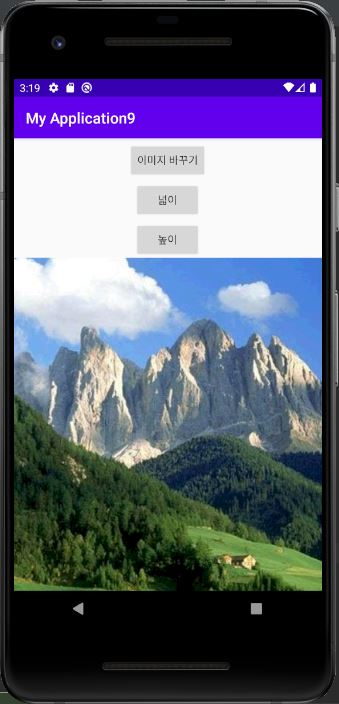
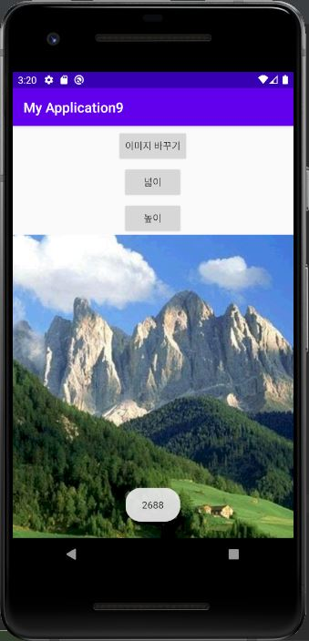
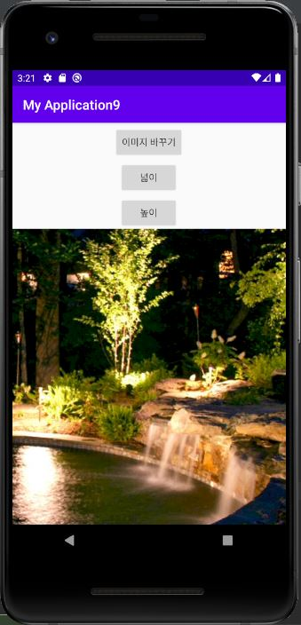
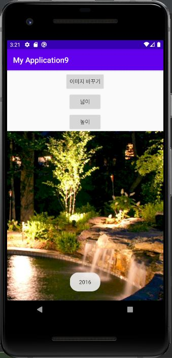

# 19173029 문세미

## 기말고사 개발관련 내용
activity_login
어플의 전체적인 컬러는 KOBIS의 로고 컬러와 비슷한 푸른 컬러들을 사용하였고, 중간에 다른 컬러들도 볼 수 있게 다양한 컬러가 있는 이미지를 사용했다.
먼저 로그인 페이지에서 로그인 버튼을 아이디와 패스워드 부분을 orientation를 사용하여 아래로 이동시켰다.
로그인 버튼을 꾸미기 위해 java>res>drawable에서 button_background.xml을 만들어 모서리를 둥글게하고 버튼 색을 변경하였다.

그리고 EditText 아이디 부분에 hint를 사용하여 아이디에 적을 수 있는 것 두가지 방법을 적어두었다.
마지막으로 로그인창에서 없어서 안될 회원가입 텍스트와 비밀번호 찾기 텍스트를 넣었고, 회원가입 텍스트는 bold와 다른 컬러를 사용하여 강조하였다.

activity_main
orientation(horizontal)을 사용하여 상단에 로고와 검색 버튼 이미지를 삽입하였고, EditText의 검색창과 검색Button 또한 orientation(horizontal)을 사용하여 기존과 배치를 다르게 하였다.
마지막으로 리사이클러뷰로 추출되는 정보의 제목과 같은 것이 없어 이를 만들기 위해 TextView를 사용하여 어떤 것을 추출하는지 볼 수 있게 하였다. 

movie_item
기존에 추출했던 데이터를 포함하여, rank, rankInten, rankOldAndNew, movieNm, 
openDt, salesAmt, salesChange, salesAcc, audiCnt, audiChange, audiAcc, scrnCnt, showCnt을 사용하여 더 많은 정보를 얻을 수 있도록 하였다.
그중에서도 랭킹진입여부, 순위증감, 순위를 제목근처에 두어 바로 볼 수 있도록 하였고, 스크린과 상영횟수 또한 같은 줄에 두었다.
마지막으로 관객수와 매출액에 padding을 주어 간격을 넓혀주었고, 각각의 일일 관객수와 매출액은 한눈에 볼 수 있도록 색을 다르게 지정하였다.

그동안 배운 것들을 활용하여 배치를 깔끔하게 하고자 하였다. 또한 한눈에 볼 수 있도록 하기위해 심플한 아이콘이나 이미지를 넣었고, 통일된 느낌을 주기위해 전체적으로 푸른 컬러를 사용하였다.

## 1주차 과제
안드로이드 제작시 기반이 되는 운영체제 : Linux

## 2주차 과제
</img>

## 3주차 과제
</img>
</img>

## 4주차 과제
- 아이디어 : 대신 관리해주는 ‘미니 비닐하우스’
자꾸만 죽는 식물을 관리해주고 식물이 잘 자랄 수 있는 환경을 만들어주는 IoT 어플이다. 미니 비닐하우스이기 때문에 대체로 상추, 깻잎 등 쌈채소를 주로 키울 수 있다.
어플과 연동되어 있는 미니 하우스(기계)에 원하는 쌈채소를 넣어 키워 재배까지 할 수 있도록 돕는 어플이다. (물에서 키우는 수경재배를 할지 흙에서 심어서 할지 아직 못정함) 

- 기능 :
  1.식물 관리
   -wifi로 미니 하우스 기계의 급수 상태와 LED 등 점등 여부를 확인 및 설정이 가능하다.
  2.LED 설정
   -빛이 부족한 실내환경에서 싹을 틔우고 꽃을 피우기 좋은 광량과 온도를 설정하는 기능으로, 앱에서 설정 가능하고 LED의 색상을 직접 선택하여 실내에서 무드등으로도 활용 가능하다.
  3.자동/수동 급수
   -미니 하우스 내 센서를 통해 흙의 습도 등을 확인하여 설정한 시간대에 자동 급수나 앱을 통해 수동으로 급수가 가능하다. (수경재배일 경우 수위센서로 수위정보를 확인하고 이에 맞게 급수를 할 수도 있음)

- 미니 비닐하우스 구상 이유 :
처음 어플을 생각했을 때 작년에 앱디자인했던 시계 쇼핑몰에 얼굴 인식 스티커와 VR기술을 활용한 스노우의 실행방법을 사용하여, 서비스를 제공하는 것을 디자인했다. 하지만 현재 가지고 있는 능력으로는 부족하다고 생각하여 일상생활에서 불편하거나 도움을 주면 좋을 것을 생각했다. 여러 아이디어 중에서 평소 식물을 잘 키우지 못하기 때문에 집에서 상추 키우는것도 어려워 집에서도 기를 수 있도록 이를 도와줄 수 있는 것이 생겼으면 좋겠다고 생각했다. 구체적으로 구상하면서 시골에 있는 비닐하우스를 떠울렸고, 현재 비닐하우스는 자동으로 물을 주고 비닐을 열어 좋은 광량을 위해 설정해주는 것이 있다는 것을 알게 되면서 이를 집에서 키울 수 있는 작은 버전의 비닐하우스를 구상하게 되었다.

## 5주차 과제
LMS에 제출

## 6주차 과제
과제물은 따로 없고 실습만

## 7주차 과제 (버튼 클릭이용하여 이미지 바꾸기)
</img>
</img>

## 8주차 중간고사

## 9주차 과제 (스크롤, 넓이높이값 띄우기)
</img>
</img>
</img>
</img>
</img>
</img>

## 10주차 과제
</img>
</img>

## 11주차 과제 (여러 화면 만들고 화면 간 전환하기)
</img>
</img>
</img>
</img>

## 12주차 과제 (웹으로 요청하기)
</img>
</img>
